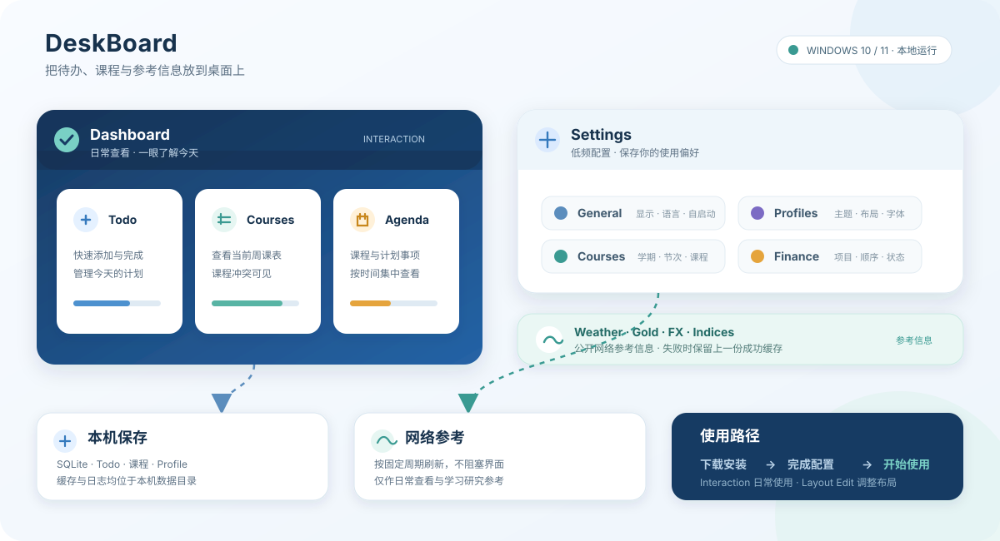

# DeskBoard

> Windows 桌面上的个人信息看板：把 Todo、课程、今日日程，以及天气和少量金融参考信息放到同一个地方。

[](https://github.com/Ronnie-32/Data_Monitor/releases/tag/v0.1.0)
[](https://github.com/Ronnie-32/Data_Monitor)
[](https://github.com/Ronnie-32/Data_Monitor)

项目定位为学习向开源项目，适合本地日常查看与技术研究。天气和金融信息仅作参考，不用于交易、风控或其他需要受监管数据质量的场景。

本项目仅用于非商业学习、研究与技术探讨，不提供交易、投资、天气安全或其他专业建议。项目不对第三方数据的访问、缓存、署名、展示或再分发作明示或默示的授权承诺；使用者请自行核验来源条款和适用法律。

## 目录

- [项目概览](#项目概览)
- [快速开始](#快速开始)
- [功能一览](#功能一览)
- [数据与隐私](#数据与隐私)
- [从源码运行](#从源码运行)
- [构建 Windows 安装包](#构建-windows-安装包)
- [相关文档](#相关文档)

## 项目概览

Dashboard 负责日常查看，Settings 负责低频配置。待办、课程和布局数据保存在本机；天气与金融项目作为独立的网络参考信息展示。



| 适合的使用场景 | 可以做什么 |
| --- | --- |
| 日常安排 | 快速查看 Todo、当天课程和今日日程 |
| 桌面信息 | 在不打开浏览器的情况下查看天气和少量参考行情 |
| 个性化布局 | 保存不同的主题、字体、组件显隐和看板布局 |
| 本机使用 | 将个人数据保存在本机，按自己的需要管理数据 |

## 快速开始

### 1. 下载并安装

从 [v0.1.0 学习预览版发布页](https://github.com/Ronnie-32/Data_Monitor/releases/tag/v0.1.0) 下载 `DeskBoard-Setup-0.1.0.exe`：

1. 双击安装包，按向导安装到当前用户目录；正常运行不需要管理员权限。
2. 从开始菜单或桌面快捷方式启动 DeskBoard。
3. 打开 Settings，按下面的“第一次配置”完成个人设置。

### 2. 第一次配置

Settings 是低频配置入口。建议按这个顺序完成设置：

| 顺序 | 页面 | 主要操作 |
| --- | --- | --- |
| 1 | `General` | 确认看板显示、透明度、语言和自启动选项 |
| 2 | `Profiles` | 选择或创建 Profile，设置主题、字体和布局 |
| 3 | `Weather` / `Finance` | 选择城市、金融项目和显示顺序 |
| 4 | `Courses` | 创建学期，配置课表时间，再添加课程 |
| 5 | `Todo` | 管理未完成事项和完成历史 |
| 6 | `Data Status` | 查看最近成功时间、失败原因和手动刷新状态 |

### 3. 日常使用

| 模式 | 适合什么时候使用 | 可以做什么 |
| --- | --- | --- |
| `Locked` | 只查看信息时 | 看板鼠标穿透，减少误触 |
| `Interaction` | 日常操作时 | 添加、完成、编辑、删除 Todo，查看可交互内容 |
| `Layout Edit` | 调整桌面布局时 | 移动或缩放小组件，完成后保存或取消 |

> [!TIP]
> 日常建议保持 `Interaction` 或 `Locked`。切换模式、显示/隐藏看板、打开 Settings 和退出程序都可以通过系统托盘完成。

网络数据按固定 60 分钟周期刷新。启动时会优先显示已有成功缓存；刷新失败不会清除上一份成功数据。

## 功能一览

| 模块 | 作用 |
| --- | --- |
| `Todo` | 添加、完成/取消完成、编辑、删除、排序和完成历史 |
| `Today Agenda` | 汇总当天课程与带计划时间的 Todo，只读展示 |
| `Courses` | 管理学期、重复课程、单次课程、取消记录和当前周课表 |
| `Weather` | 查看城市天气、当前温度、高低温和风力摘要 |
| `Gold` / `FX` | 查看黄金和人民币汇率参考值 |
| `China / U.S. Indices` | 查看主要 A 股和美国指数参考值 |
| `Finance Overview` | 按全局顺序汇总已启用的金融参考项目 |
| `Profiles` | 保存看板位置、大小、组件布局、显隐、主题、字体和显示偏好 |

Todo 的 Deadline 不会自动生成 Agenda 项目；只有计划日期/时间会进入当天 Agenda 或周课表。课程与 Todo 时间重叠时会保留两者，并显示冲突信息，不会自动改期。

## 数据、隐私和限制

### 本机数据

个人 Todo、课程、Profile、缓存和日志保存在本机，不上传到 DeskBoard 服务器。

| 内容 | 位置或行为 |
| --- | --- |
| SQLite 数据库 | `%LOCALAPPDATA%\DeskBoard\data\deskboard.db` |
| 运行日志 | `%LOCALAPPDATA%\DeskBoard\logs\` |
| 自启动 | 默认关闭，只写入当前 Windows 用户的 Run 设置，不使用 Windows 服务 |
| 卸载后的数据 | 默认保留 `%LOCALAPPDATA%\DeskBoard` 中的个人数据，请按自己的需要清理 |

### 网络参考数据

天气、黄金、汇率和指数只用于日常查看与学习研究参考。网络数据按固定 60 分钟周期刷新；启动时优先显示已有成功缓存，刷新失败不会清除上一份成功数据。

数据不承诺实时、交易级、投资级、完整、准确或连续可用，也不构成投资建议、交易依据或任何收益保证。当前来源、访问证据和条款风险见[数据源审计](docs/data-sources.md)。

### 当前边界

- 当前只支持主显示器；天气和金融来源可能延迟、缺失或临时不可用。
- 当前版本不包含通知提醒、插件、数据导入导出、交易下单、金融历史曲线、新闻或多显示器架构。

## 从源码运行

### 环境要求

- Windows 10/11 64 位；
- Python 3.12.x；
- 能正常启动 Qt WebEngine 的桌面会话。

### 启动开发版本

在 PowerShell 中执行：

```powershell
py -3.12 -m venv .venv
.\.venv\Scripts\python.exe -m pip install --upgrade pip
.\.venv\Scripts\python.exe -m pip install -e .
.\.venv\Scripts\python.exe -m pip install pytest ruff pyinstaller

$env:PYTHONPATH = (Resolve-Path 'src').Path
.\.venv\Scripts\python.exe -m deskboard
```

如果只想验证入口而不打开完整交互界面，可以使用项目已有的测试和 smoke 脚本。正常测试不依赖实时网络。

## 构建 Windows 安装包

需要先安装 Inno Setup 6，并确保 `ISCC.exe` 已加入 PATH 或位于默认安装目录中。

### 完整构建

下面的命令会构建 PyInstaller onedir，并继续编译 Inno Setup 安装包：

```powershell
.\scripts\build.ps1 -Clean
```

### 只构建 onedir

如果只需要 PyInstaller onedir，不编译 Inno Setup 安装包：

```powershell
.\scripts\build.ps1 -Clean -SkipInstaller
```

### 输出与 smoke 检查

构建完成后，主要输出位于：

- onedir：`dist\DeskBoard\DeskBoard.exe`
- 安装包：`dist\installer\DeskBoard-Setup-0.1.0.exe`

对已构建的 onedir 做隔离数据目录 smoke 检查：

```powershell
.\scripts\smoke_test.ps1 -DisableQtWebEngineSandbox
```

## 相关文档

**产品与实现**

- [产品规范](docs/spec.md)
- [实现计划](docs/implementation-plan.md)
- [界面设计说明](docs/ui-design.md)

**数据、质量与发布**

- [数据源审计](docs/data-sources.md)
- [稳定性验收清单](docs/v1-stability-checklist.md)
- [发布检查清单](docs/release-checklist.md)
- [v0.1.0 学习预览版说明](docs/release-notes-v0.1.0.md)

**Windows 人工验收**

- [Task 30/31 Windows 人工验收步骤](docs/task30-manual-acceptance.md)、[Task 31 补充步骤](docs/task31-manual-acceptance.md)

## 维护者说明

DeskBoard 使用 PySide6、单个 QWebEngineView、本地 HTML/CSS/ES Modules、GridStack、SQLite 和 direct HTTP Provider。Python 是业务真相，Dashboard JavaScript 只负责渲染和轻量交互。
